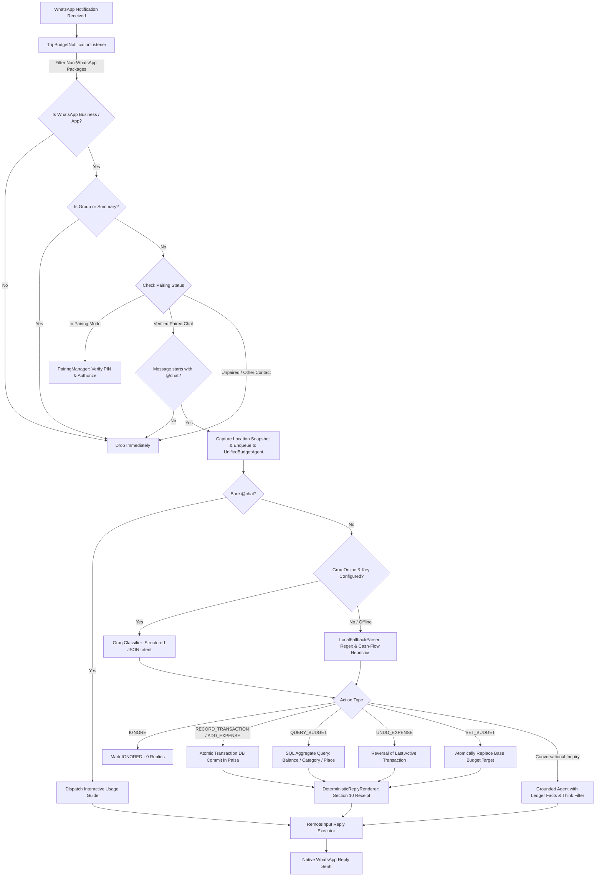

# 🏍️ TripHisaab (Trip Budget)

> **Native Android WhatsApp Expense Assistant & Travel Ledger**  
> *Track expenses automatically by simply texting from your personal WhatsApp to WhatsApp Business on the same phone — completely offline-capable, AI-powered, location-aware, and serverless.*

---

## 📖 Overview

**TripHisaab** is a native Android application built to solve a real-world travel dilemma: logging expenses on the go without the friction of opening complex spreadsheet apps or switching contexts. Originally engineered for a motorcycle expedition from Islamabad to the Khunjerab Pass (Pakistan–China border), it turns your WhatsApp into a personal expense assistant.

### The Problem
During road trips or busy days, opening an expense tracking app to type amounts, categories, and locations creates too much friction. Most people end up forgetting expenses or letting receipts pile up. Traditional WhatsApp bots require hosting Node.js/Python servers, running background laptops/Termux, or paying for expensive Meta WhatsApp Business Cloud APIs.

### The TripHisaab Solution
TripHisaab runs **100% natively on your Android smartphone**. It utilizes Android's `NotificationListenerService` to detect incoming messages sent from your personal WhatsApp account to your WhatsApp Business account on the same phone. It parses the purchase intent via ultra-fast Groq LLM inference (with a resilient local regex/rule fallback), tags the expense with device-derived GPS location and reverse-geocoded locality, commits the transaction to an ACID-compliant Room SQLite ledger, and fires a deterministic receipt reply back into the WhatsApp conversation using Android's native `RemoteInput` reply mechanism.

No servers, no webhooks, no subscriptions, and no privacy leaks.

---

## ✨ Key Features

- **📱 Phone-Native WhatsApp Integration**
  - Uses Android's `NotificationListenerService` to intercept messages directly on-device.
  - Zero third-party bot servers or paid Meta WhatsApp Cloud API accounts needed.
  - Sends immediate confirmations and answers back in the WhatsApp chat via Android `RemoteInput` notification actions.

- **⚡ Activation Rule: Everything Requires `@chat`**
  - To ensure 100% intentional interaction and avoid processing non-expense personal banter, **every command and query must begin with the `@chat` token** (case-insensitive).
  - Unprefixed messages trigger **0 AI calls, 0 financial writes, 0 replies, 0 location captures, and 0 retained message text**.
  - Sending bare `@chat` displays a friendly interactive usage guide.
  - Examples:
    - `@chat petrol 2200` → Record fuel spending
    - `@chat petroll - 2,200` → Record fuel spending with hyphen/typo tolerance
    - `@chat bhai ne 5000 bhej diye` → Record incoming funds / income
    - `@chat Qaisar ko udhaar 5000 diya` → Record personal loan given
    - `@chat set total budget to 50,000` → Atomically replace authoritative base budget
    - `@chat Islamabad ka total kharcha` → Place-specific itemized ledger summary
    - `@chat kitna bacha hai` → Overall available funds and balance check
    - `@chat undo` → Reversal of last transaction

- **🔒 Cryptographic Chat Pairing & Privacy Isolation**
  - Pairs via a secure 5-minute cryptographic single-use PIN sent between accounts.
  - Strictly filters by package (`com.whatsapp.w4b` / `com.whatsapp`) and verified conversation ID.
  - **Zero data retention for unrelated chats:** Messages from clients, family, or other contacts are immediately dropped without reading, storing, or logging.
  - Echo suppression prevents recursive bot reply loops.

- **🤖 Unified Agent Pipeline & Reasoning Filter**
  - Replaced legacy separate read-only chat managers with a unified, bounded tool-calling loop (max 3 iterations).
  - Powered by **Groq Cloud API** (supporting `openai/gpt-oss-120b`, `llama-3.3-70b-versatile`, etc.) with seamless offline fallback.
  - **Zero Reasoning Leaks:** Automatically strips `<think>`, `<thought>`, and internal monologue tags.
  - Enforces strict JSON schemas and integer paisa arithmetic.

- **💰 Real Cash-Flow Ledger & Authoritative Formula**
  - Supports full transaction types: `EXPENSE`, `INCOME`, `GIFT_RECEIVED`, `GIFT_SENT`, `LOAN_GIVEN`, `LOAN_RECEIVED`, `LOAN_REPAYMENT_RECEIVED`, `LOAN_REPAYMENT_PAID`, `REFUND_RECEIVED`, `TRANSFER_IN`, `TRANSFER_OUT`, `ADJUSTMENT`.
  - Authoritative balance calculation:
    - **`Available funds = base budget + added funds - cash out`**
    - **`Cash out = expense spending + gifts given + loans given + transfers out`**
    - **`Added funds = income + gifts received + loans received + loan repayments received + refunds + transfers in`**
  - Single authoritative base budget prevents discrepancies (fixes the 100k vs 50k bug).

- **📍 Real-Time Location Freshness & Accurate Place Queries**
  - Freshness evaluated using `elapsedRealtimeNanos` against device location fixes.
  - Dashboard Current Location Card shows Town/City, Fix Age, Accuracy, Provider, and a 1-tap "Refresh Location" action.
  - Fixes the legacy blind Islamabad backfill bug: if a city has no records, cleanly informs: `"Islamabad mein abhi koi recorded expense nahi hai."`.
  - Distinguishes locality from district (e.g. Gilgit City vs. Gilgit District).

- **🏷️ Comprehensive 24-Category Taxonomy**
  - 24 main categories and 300+ hierarchical leaves with Roman Urdu and English aliases tailored for Northern Pakistan road trips (Transport, Fuel, Meals, Tea/Coffee, Motorcycle Maintenance, Repairs, Accessories, Charity/Sadqa, Lending/Udhaar, etc.).

---

## 🏗️ Architecture & Processing Pipeline



---

## 📂 Project Structure

```
triphisaab/
├── app/
│   ├── build.gradle.kts             # App build configuration & dependencies
│   ├── proguard-rules.pro           # Proguard optimization rules
│   └── src/
│       ├── main/
│       │   ├── AndroidManifest.xml   # Permissions, Services, and Launcher declaration
│       │   ├── java/com/example/
│       │   │   ├── MainActivity.kt               # Single Activity host with Jetpack Compose Navigation
│       │   │   ├── TripBudgetApplication.kt      # Application class initializing Room & Singletons
│       │   │   ├── ai/                           # LLM & Classification Engine
│       │   │   │   ├── ClassifierContract.kt     # Data models for classifier schema
│       │   │   │   ├── GroqClassifier.kt         # Groq API client with JSON schema enforcement
│       │   │   │   ├── KeystoreSecretManager.kt  # Android Keystore AES-GCM key encryption
│       │   │   │   └── LocalFallbackParser.kt    # Offline regex-based expense extractor
│       │   │   ├── data/                         # Persistence & Repositories
│       │   │   │   ├── db/                       # Room Database & DAOs
│       │   │   │   ├── model/Entities.kt         # SQLite Entities (Expense, InboxEvent, Location, etc.)
│       │   │   │   └── repository/               # Ledger, Settings, & Category Managers
│       │   │   ├── engine/                       # Core Business Logic
│       │   │   │   ├── BudgetProcessingEngine.kt # Central mutex-serialized processing pipeline
│       │   │   │   ├── BudgetChatManager.kt      # Contextual conversational advisor (@chat)
│       │   │   │   ├── DeterministicReplyRenderer.kt # Fixed, hallucination-free receipt templates
│       │   │   │   ├── MoneyFormatter.kt         # Paisa <-> Rupees arithmetic (no floats)
│       │   │   │   └── TripDateParser.kt         # Urdu & English relative date parser
│       │   │   ├── location/                     # Location & Geocoding
│       │   │   │   ├── LocationTrackingService.kt# Foreground service with persistent notification
│       │   │   │   ├── TripLocationProvider.kt   # FusedLocationProvider candidate snapshot buffer
│       │   │   │   └── TripGeocoder.kt           # Asynchronous Android Geocoder with cell cache
│       │   │   ├── notifications/                # WhatsApp Notification Capture & Reply
│       │   │   │   ├── TripBudgetNotificationListener.kt # Core NotificationListenerService
│       │   │   │   ├── PairingManager.kt         # Single-use PIN pairing engine
│       │   │   │   ├── ReplyExecutor.kt          # RemoteInput direct reply invoker
│       │   │   │   └── ListenerDiagnostics.kt    # Health monitoring & payload diagnostics
│       │   │   └── ui/                           # Jetpack Compose UI
│       │   │       ├── MainViewModel.kt          # UI state management & flows
│       │   │       ├── screens/                  # Home, Expenses, Locations, Review, Settings, Setup
│       │   │       └── theme/                    # High-contrast Material 3 design tokens
│       └── test/                             # Robolectric & JUnit unit tests
│           └── java/com/example/
│               └── TripBudgetTest.kt         # Tests for Money, Parser, DB, and Templates
├── gradle/
│   └── libs.versions.toml           # Version Catalog for Gradle dependencies
├── build.gradle.kts                 # Root Gradle build script
├── settings.gradle.kts              # Gradle project configuration
└── PRD.md                           # Detailed Product Requirements & Technical Specs
```

---

## 🚀 Getting Started

### Prerequisites
- **Android Smartphone:** Running Android 10 (API Level 29) or higher.
- **WhatsApp Configuration:**
  - WhatsApp Business (`com.whatsapp.w4b`) and Personal WhatsApp (`com.whatsapp`) installed on the same phone.
- **Groq Cloud API Key:** Free tier key from [console.groq.com](https://console.groq.com) (Optional, but recommended for natural language classification).
- **Development Environment:** Android Studio Ladybug / Meerkat (or newer) with JDK 17+.

---

### Step-by-Step Setup Guide

#### 1. Clone & Open the Project
```bash
git clone https://github.com/mahadbaig2/triphisaab.git
cd triphisaab/triphisaab
```
Open the `triphisaab` folder in **Android Studio** and let Gradle synchronize dependencies.

#### 2. Build & Install APK
Connect your Android phone via USB (with USB Debugging enabled) and run:
```bash
./gradlew assembleDebug installDebug
```
Or simply press **Run (Shift + F10)** in Android Studio.

#### 3. Complete In-App Setup Wizard
When you first launch **TripHisaab**, the setup wizard will guide you through:
1. **Grant Notification Access:** Tap to open Android Settings and enable the switch for *Trip Budget Notification Listener*.
2. **Pair with WhatsApp:**
   - Tap **Generate Pairing Code** (a 6-digit cryptographic PIN valid for 5 minutes).
   - From your personal WhatsApp, send that 6-digit code in a message to your WhatsApp Business number.
   - The app detects the handshake, records the conversation identity, and fires a test reply: *"Trip Budget connected successfully!"*.
3. **Configure Groq API Key:**
   - Paste your Groq API key (stored securely in Android Keystore).
   - Select your preferred model (default: `openai/gpt-oss-120b` or `llama-3.3-70b-versatile`).
   - Run the in-app connectivity test to confirm authentication.
4. **Grant Location Permissions:**
   - Allow Foreground & Background Location permissions to enable automated GPS tagging.
5. **Set Initial Trip Budget:**
   - Enter your target budget (e.g. `Rs. 50,000`).

---

## 💬 Usage & Syntax Examples

Once paired, you never need to keep the TripHisaab app open. Simply send messages from your personal WhatsApp to your Business number:

### 1. Recording Expenses (English & Roman Urdu)
| WhatsApp Message | Categorization | Deterministic WhatsApp Reply |
| :--- | :--- | :--- |
| `Petrol 2200` | Transport > Fuel | `Recorded: Petrol — Rs. 2,200`<br>`Category: Transport (Fuel)`<br>`Location: Islamabad (device location)`<br>`Total spent: Rs. 2,200 \| Remaining: Rs. 47,800` |
| `petrol bharwaya 2200 ka` | Transport > Fuel | `Recorded: Petrol — Rs. 2,200 ...` |
| `helmet 3500 liya bike ke liye` | Motorcycle > Accessories | `Recorded: Helmet — Rs. 3,500 ...` |
| `nashta 350 aur chai 80` | Food & Drinks > Meals / Tea | Multi-item batch recorded with individual breakdown & batch sum |
| `Ali ko udhaar diya 5000` | Lending > Personal Loan | `Recorded: Ali ko udhaar — Rs. 5,000 ...` |

### 2. Spending Inquiries
| WhatsApp Query | Action |
| :--- | :--- |
| `Total kharcha kitna hua?` | Returns total spent across entire trip with remaining balance. |
| `Gilgit mein kitna kharcha hua?` | Filters ledger strictly by resolved locality `Gilgit` and displays itemized page. |
| `Kitna bacha hai?` | Reports remaining budget and warns if over-budget. |
| `Today spending` | Returns summary of all expenses logged on the current calendar day. |

### 3. Corrections & Commands
| Command | Result |
| :--- | :--- |
| `undo` / `wapas` | Reverses the last committed expense and restores previous balance. |
| `set budget 60000` | Updates active budget limit to Rs. 60,000. |
| `@chat am I overspending on fuel?` | Contextual conversational response analyzing current fuel expenditure vs. overall budget. |

---

## 🔒 Security & Privacy

- **On-Device Storage:** The SQLite database is saved entirely inside Android's protected internal app storage directory (`/data/data/com.aistudio.tripbudget.mhdkz/databases/`).
- **Hardware-Backed Cryptography:** API keys are never stored in plaintext or SharedPreferences; they are encrypted using Android Keystore AES-256-GCM.
- **Zero Ingestion of Outside Chats:** The notification listener evaluates the package name and conversation identifier before any message text is read. Messages from third-party chats or clients are instantly discarded.
- **No Leaked Financial Computations:** The LLM is never trusted to calculate totals, balances, or remaining money. Calculations are computed deterministically via Room SQLite.

---

## 🛠️ Tech Stack

- **Language:** [Kotlin 2.x](https://kotlinlang.org/)
- **UI Framework:** [Jetpack Compose](https://developer.android.com/jetpack/compose) with Material 3
- **Local Persistence:** [Android Room SQLite](https://developer.android.com/training/data-storage/room)
- **Asynchronous Flow:** Kotlin Coroutines & StateFlow / SharedFlow
- **Background Work:** Android Foreground Services (`FOREGROUND_SERVICE_LOCATION`) & WorkManager
- **Networking & JSON:** [OkHttp 4](https://square.github.io/okhttp/), [Retrofit 2](https://square.github.io/retrofit/), and [Moshi](https://github.com/square/moshi)
- **Location Services:** Google Play Services FusedLocationProvider & Android Geocoder
- **LLM Inference:** Groq Cloud API (`openai/gpt-oss-120b`, `llama-3.3-70b-versatile`)
- **Unit & UI Testing:** JUnit 4, [Robolectric](https://robolectric.org/), and [Roborazzi](https://github.com/takahirom/roborazzi)

---

## 📄 License & Author

**Author:** [Mahad Baig](https://github.com/mahadbaig2)  
Designed and built for motorcycle trip preparation and travel expense accounting.
Licensed under the [MIT License](LICENSE).
